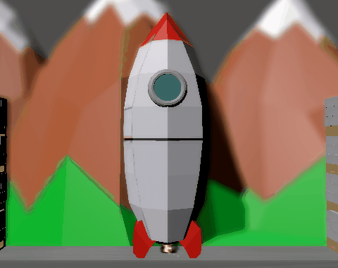

<h1 align="center">aVoid (the Void)</h1>
 

  

  Escape the Void, save yourself.
   
   
  <a href="https://guibdbello.itch.io/avoid-the-void">Play Game</a>
  ·
  <a href="https://github.com/github_username/repo_name/issues/new?labels=bug&template=bug-report---.md">Report Bug</a>
  ·
  <a href="https://github.com/github_username/repo_name/issues/new?labels=enhancement&template=feature-request---.md">Request Feature</a>

## Table of Contents

<ol>
  <li><a href="#introduction">Introduction</a></li>
  <li><a href="#getting-started">Getting Started</a></li>
  <li><a href="#build-process">Build Process</a></li>
  <li><a href="#acknowledgments">Acknowledgments</a></li>
  <li><a href="#license">License</a></li>
</ol>

## Introduction

The Void is absorbing your entire planet. The only way to save yourself is to take a Rocketship and find another planet to live.

  

### How to Play

- **A**/**D**: Move left/right.
- **W** or **Spacebar**: Jump.
- Hold jump button to jump higher.

### Game Design Document

Check out the [One-Page GDD](docs/one-page-gdd.pdf).

### Game Jam

This game was made for [Godot Wild Jam #69](https://itch.io/jam/godot-wild-jam-69), which took place between May 10th and May 19th of 2024.

Theme: **Void**.

(<a href="#readme-top">back to top</a>)

## Getting Started

To get a local copy up and running follow the steps below.

### Prerequisites

1. [Godot](https://godotengine.org/)

### Configuration

1. Clone repository: `git clone https://github.com/GuiBDBello/godot-maze-generator.git`.
1. Import the project in Godot: `Import > Select the project folder > Import & Edit`.

(<a href="#readme-top">back to top</a>)

## Build Process

1. In Godot, select `Project > Export...`.
1. Select the `Presets`.
1. Click on `Export Project...`.
1. Select the folder and press `Save`.

(<a href="#readme-top">back to top</a>)

## Acknowledgments

List of references that were useful in the making of this project:

* Cutscene: [Crow Games YouTube channel](https://www.youtube.com/@CrowGamesDev)
* Player controller: [Chaff Games YouTube channel](https://www.youtube.com/@Chaff_Games)
* Shader: [Le Lu YouTube channel](https://www.youtube.com/@Le_x_Lu)
* UI: [Gwizz YouTube channel](https://www.youtube.com/@Gwizz1027)
* VFX: [Gabriel Aguiar Prod. YouTube channel](https://www.youtube.com/@GabrielAguiarProd)

### Assets

| Name | Type | Creator | Source |
| --- | --- | --- | --- |
| GDD Template | Document | [Game Dev Underground](http://gdu.io/) | [Google Docs](https://docs.google.com/document/d/1npEvqcMZSp0IX2hWw6Qq0WqJVfmVqS_YOGFWnnwfh-A/edit#heading=h.1s1dfwgzecqh) |

(<a href="#readme-top">back to top</a>)

## License

Distributed under the MIT License. See [LICENSE](./LICENSE) for more information.

(<a href="#readme-top">back to top</a>)

